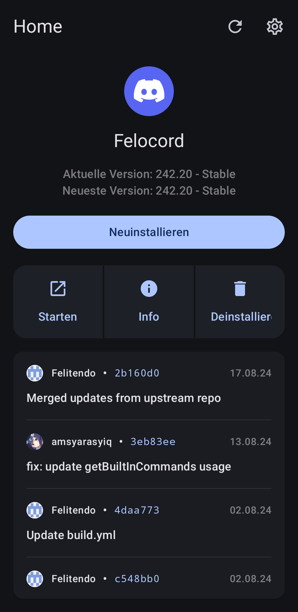

  
  
  # Bunny Manager

  Easily install Bunny on Android

  
  
  ---

   

  
  
  
  
   
  
  
  &color=blue)
  &color=blue)
  

   

  
  

Build
---

#### Prerequisites
  - [Git](https://git-scm.com/downloads)
  - [JDK 17](https://www.oracle.com/java/technologies/javase/jdk11-archive-downloads.html)
  - [Android SDK](https://developer.android.com/studio)

#### Instructions

1. Clone the repo
    - `git clone https://github.com/pyoncord/BunnyManager.git && cd BunnyManager`
2. Build the project
    - Linux: `chmod +x ./gradlew && gradlew assembleDebug`
    - Windows: `./gradlew assembleDebug`
3. Install on device
    - [Enable USB debugging](https://developer.android.com/studio/debug/dev-options) and plug in your phone
    - Run `adb install app/build/outputs/apk/debug/app-debug.apk`

## Contributing

This is an open-source project, you can do so without any programming.

Here are a few things you can do:

- [Test and report issues](https://github.com/pyoncord/BunnyManager/issues/new/choose)
<!-- - [Translate the app into your language](https://crowdin.com/project/vendetta-manager) -->
    
License
---
Bunny Manager is licensed under the Open Software License version 3.0

